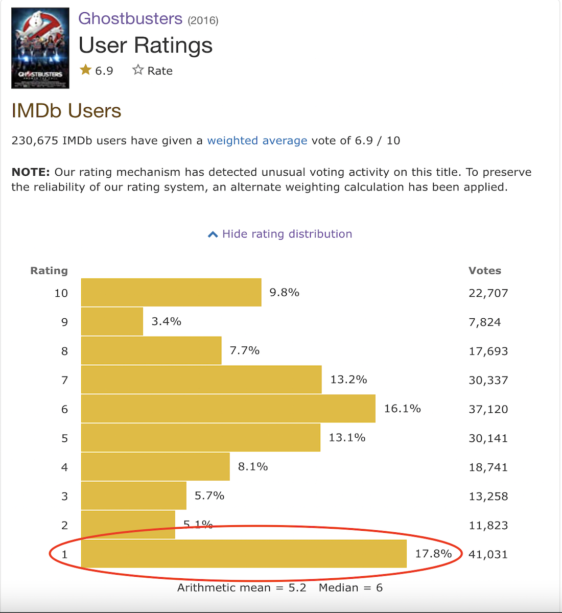
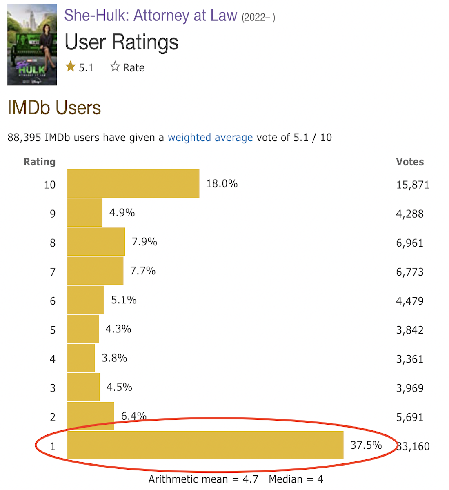

```{r setup, include=FALSE}
knitr::opts_chunk$set(echo = TRUE)
library(tidyverse)
library(plotly)
library(kableExtra)
library(DT)
library(shiny)

# CSS <- htmltools::HTML("td .form-group {margin-bottom: 0;}")

# <figure>
#     
#     <figcaption>Caption goes here</figcaption>
# </figure>
all_movies_with_ratings_df <- readRDS("~/my-website/content/post/2022-08-31-IMDb-review-bombing/all_movies_with_women_directors_df.RDS")
all_movies_with_ratings_df$img_url4 <- with(all_movies_with_ratings_df, paste0("<figure>", "<style>
    a { color: darkblue; } /* CSS link color */
  </style>", img_url4 %>% str_replace_all("height=120></img>", "height=120 width=100></img>"), "<figcaption style=\"text-align-center\"><strong>", Title, "</strong> (", Year, ")", "</figcaption>
</figure>"))
all_movies_with_ratings_df$img_url4 <- with(all_movies_with_ratings_df, paste0("<a href = ", ratings_url, ">", img_url4, "</a>"))
all_movies_with_ratings_df$Percentage_1 <- with(all_movies_with_ratings_df, paste0("<br><br><br><br><strong>", Percentage_1, "</strong>"))

get_auteur <- function(dbl_list){
  
  writer = list1 %>% unlist()
  director = list2 %>% unlist()
  writer == director
}
all_movies_with_ratings_df$Writers_pulled <- all_movies_with_ratings_df$Writers %>% lapply(paste0, collapse = "|") %>% as.character
all_movies_with_ratings_df$Directors_pulled <- all_movies_with_ratings_df$Directors %>% lapply(paste0, collapse = "|") %>% as.character

all_movies_with_ratings_df$Auteur_bin <- with(all_movies_with_ratings_df, ifelse(Directors_pulled %>% str_detect(Writers_pulled), 1, 0))  %>% as.factor()

all_movies_with_ratings_df$Horror_bin <- with(all_movies_with_ratings_df, Genres %>% str_detect("Horror")) %>% as.factor()

all_movies_with_ratings_df$Comedy_bin <- with(all_movies_with_ratings_df, Genres %>% str_detect("Comedy")) %>% as.factor()

all_movies_with_ratings_df$Drama_bin <- with(all_movies_with_ratings_df, Genres %>% str_detect("Drama")) %>% as.factor()

all_movies_with_ratings_df$Action_bin <- with(all_movies_with_ratings_df, Genres %>% str_detect("Action")) %>% as.factor()

all_movies_with_ratings_df$Gender_rating_gap <- with(all_movies_with_ratings_df, as.numeric(All.Ages_ratings_Females) - as.numeric(All.Ages_ratings_Males))

```

```{r, echo = FALSE}
# if (!require('knitr')) {
#   install.packages("knitr")
# }
# if (!require('devtools')) {
#   install.packages("devtools")
# }
# if (!require('RWordPress')) {
#   devtools::install_github(c("duncantl/XMLRPC", "duncantl/RWordPress"))
# }
```


## IMDb Review-bombing: from Ghostbusters (2016) to She-Hulk (2022)

Every year, a few movies (and TV shows) garner an unusually high volume of terrible ratings on IMDb. The first time such “review bombing” caught my attention was in 2016 with the release of the female-led [Ghostbusters (2016)](https://www.imdb.com/title/tt1289401/?ref_=nv_sr_srsg_6) reboot. The ratings were so irregular that IMDb decided to employ an “an alternate weighting calculation” and it now has a solid 6.9/10.

<center> 
{width=85%} {width=85%}
</center>

More recently, Marvel’s latest [She-Hulk: Attorney at Law](https://www.imdb.com/title/tt10857160/?ref_=nv_sr_srsg_0) suffers from 37.5% of all its ratings being 1/10s (as of September 14, 2022). A back-and-forth debate of “this screams misogyny” and “well why don’t [Wonder Woman](https://www.imdb.com/title/tt0451279/?ref_=nv_sr_srsg_0) and [Kill Bill](https://www.imdb.com/title/tt0266697/?ref_=nv_sr_srsg_0) also have low ratings then?” plagued my social media. Though we can always come up with women-starring movies appreciated by IMDb users, it does not mean that the attacks on She-Hulk and Ghostbusters are not founded on misogyny. A lot of misogynists love women - as long as they fit in the box of what a woman should be and do. Maybe She-Hulk and Ghostbusters are outside of that box, or maybe they truly are terrible.

### Question of interest
The goal of this post is to use my amateur web scraping and more-than-amateur data analysis skills to explore the following question: <font size="5"> <strong>are specific kinds of movies more likely to encounter hate on IMDb than others? </font> </strong> Are movies with a woman lead more likely to be hated on than movies with a non-woman lead? How about if the two leads are women? If it was (co-)written by a woman, or (co-)directed by a woman? I’ll also look into non-gender variables obtainable on IMDb. The full list of variables considered, and their definitions, is displayed in the [Glossary].


### How do we measure hate? What constitutes a hated movie?  

By my choosing, <font size="3"> <strong> a movie’s hate will be measured by the proportion of IMDb ratings that are 1/10</strong> </font>. The more 1/10 ratings a movie gets, the more hated it is.

A movie will be considered to be ‘Hated’ if it is one of the 100 most hated films in its Metascore group, ie if it is among the 100 films with the highest proportion of 1/10 IMDb ratings. Classifying movies into Hated or Not Hated was a personal choice, and so was the way a Hated movie is defined. I like this approach as it allows us to look at each kind of movie (eg woman-led, Horror, etc) and find the proportion of them that are Hated, giving us a naive estimate for the probability of hating a specific kind of movie. We can then compare that to the proportion of the other movies (eg non-woman-led, non-Horror, etc) that are Hated. If the difference is large enough for us, then we can conclude IMDb users are biased against/in favour of those kinds of movies.

#### Grouping movies by Metascore Rating

Now, a movie with a high proportion of 1/10s could simply be a terrible movie (as the “What about Kill Bill and Wonder Woman” crowd would argue). My proposed solution to differentiate the terrible movies from the not terrible movies is by separating films based on their Metacritic’s Metascore Ratings. Metacritic splits movies into [three tiers](https://www.metacritic.com/about-metascores): 1. Metascore between 61-100, 2. Metascore between 40-60 and 3. Metascore between 1-39. From hereafter, the 3 groups will be referred as Favourable, Mixed, and Unfavourable movies, respectively for brevity’s sake. Since movies are grouped within similarly-rated films, those with more 1/10 ratings can be interpreted as more hated rather than worse in quality.

##### Why Metascore?    
<span style="color:grey"> 
<font size = "2"> Don't care? Skip right to [Films included in analysis]. 
<span style="color:grey"> 
<font size = "2">    
Why you might not like Metascore:          </font> 
<span style="color:grey"> 
<ul>
<br>
<font size = "2"> 1. Critics are pretentious and do not represent the general population; they probably like art house films more than the average moviegoer, and blockbuster films less.       
2. Any IMDb bias detected in this analysis can instead be attributed to Metascore bias in the opposite direction. That is, if we find a disproportionate amount of IMDb "hate" for woman-led films, maybe it's actually a disproportionate amount of Metacritics "love" we are observing. 
</ul>    

Why I like Metascore:   
<ul>
<br>
1. they are posted within movies' IMDb pages so it makes scraping the data easier for me, and      
2. they are independent of IMDb ratings since they are based purely on critic reviews, and       
3. critics risk their professional reputation if they let their own personal biases turn their review into an exaggerated, take-down piece.
</ul>
In my opinion, the pros outweigh the cons. I believe that a Metacritic-liked film with a high proportion of 1/10 ratings on IMDb is likely a victim of unjust review bombing. 

Maybe you’re still not convinced. If it helps, below is a chart of the Metascore ratings of the 2400+ movies released between 2000 and 2019 that received 50K+ IMDb ratings; please <strong> feel free to hover over movies with high, medium, and low Metascores</strong>. Or in the table below (Table 1), you can <strong>look up the title of any movie in the Search bar to see its Metascore rating</strong>.
<!-- MIGHT DELETE: If afterwards you still do not trust Metascore, then the analysis is not wasted on you. A revealed bias, whether you believe it to be on IMDb or Metascore's side, is a revealed bias nonetheless and we learn to not trust movie-rating platforms for certain kinds of movies. -->

```{r, include = FALSE}
months_ordered <- c("January", "February", "March", "April", "May", "June", "July", "August", "September", "October", "November", "December")
all_movies_with_ratings_df$Release_month <- with(all_movies_with_ratings_df, ifelse(Release_month %in% months_ordered, Release_month, "NA"))
all_movies_with_ratings_df$Release_month <- with(all_movies_with_ratings_df, factor(Release_month, levels = c("NA", months_ordered)))
all_movies_with_ratings_df$Metascore_Score_Meaning <- with(all_movies_with_ratings_df, ifelse(Metascore_rating > 60, "Favourable Reviews (61-100)", ifelse(Metascore_rating > 39, "Mixed Reviews (40-60)", "Unfavourable Reviews (0-39)"))) %>% as.factor()

```

```{r, echo = FALSE, out.width="100%"}
mycols <- c("#86af49", "#EEDC82", "#bc5a45")
all_movies_with_ratings_df50K <- all_movies_with_ratings_df %>% filter(Year >= 2000, Year <= 2019, IMDB_raters_count >= 50000)


fig <- plot_ly(data = all_movies_with_ratings_df50K, x = ~Year, 
    y = ~Metascore_rating, 
    color = ~Metascore_Score_Meaning, 
    colors = c("Dark Green", "Gold", "Red"),
    text = ~Title_year, type = 'scatter', mode = 'markers') 

fig <- fig %>%
  add_trace(
    hoverinfo = 'y',
    hovertemplate = paste('<b>%{text}</b>',
                          '<br>Metascore: %{y:.2f}<extra></extra>'),
    showlegend = F
  ) 
fig <- fig %>%
  layout(
    title = paste0("<b> Metascore Ratings </b> <br> (Movies released in 2000-2019 w/ 50K+ IMDb reviews) <br> <br>"))
mrg <- list(l = 20, r = 50,
          b = 50, t = 50,
          pad = 20)
fig  %>%
    layout(showlegend = TRUE, legend = list(font = list(size = 10)), margin = mrg,
           xaxis = list(title = 'Release Year'),
           yaxis = list(title = 'Metascore Rating'))

```


```{r, echo = FALSE, out.width="100%", }
datatable(all_movies_with_ratings_df50K %>% arrange((Title_year)) %>% select(Title_year, Metascore_rating) %>% rename("Title (Year)" = Title_year, "Metascore Rating" = Metascore_rating), caption = "Table 1: Metascore Ratings of Movies (released in 2000-2019 w/ 50K+ IMDb reviews)",options = list(pageLength = 8,
                                                                                                                                                                                                            
  initComplete = JS(
    "function(settings, json) {",
    "$(this.api().table().header()).css({'background-color': 'darkblue', 'color': '#fff'});",
    "}")
)) %>%
  formatStyle(
    'Metascore Rating',
    color = styleInterval(c(39, 60), c('white', 'black', 'white')),
    backgroundColor = styleInterval(c(39, 60), c('#bc5a45', '#EEDC82', '#86af49'))
  )

# c("#86af49", "#DAA520", "#bc5a45")
```
<!-- Note: in the future, I plan on investigating more thoroughly the differences between IMDb, Metascore, Rotten Tomatoes Critics and Rotten Tomatoes Audience scores to better identify each platform's biases.   -->

</span>
</font>
      
### Films included in analysis
Don't care? Skip right to [Results].    

Only movies released in the last two decades (2000-2019) will be included in this analysis. Movies with fewer than 50,000 ratings on IMDb are removed so that the films we investigate are more likely to be known by the average moviegoer (and reader of this post). Finally, we also removed movies not rated by Metascore. 2,417 movies on IMDb fit this criteria. 

The pie chart below breaks down the 2,417 movies movies into the 3 Metascore-based groups. 44% (1062) are Favourable, 40% (972) are Mixed, and the remaining 16% (383) are Unfavourable.      

```{r, echo = FALSE}

mycols <- c("#86af49", "#EEDC82", "#bc5a45")

all_movies_with_ratings_df50K %>% group_by(Metascore_Score_Meaning) %>% count() %>% ungroup() %>% mutate(prop = round(n / sum(n)*100, 1)) %>% arrange(desc(Metascore_Score_Meaning)) %>% mutate(lab.ypos = cumsum(prop) - 0.5*prop) %>%
  ggplot(aes(x = "", y=prop, fill = Metascore_Score_Meaning)) +
  geom_bar(width = 1, stat = "identity", color = "white") +
  coord_polar("y", start = 0)+
  geom_text(aes(y = lab.ypos, label = paste0(prop, "%\n(", n, " films)")), color = c("white", "black", "white"))+
  scale_fill_manual(values = mycols) +
  theme_void()+
  theme(
        legend.title=element_blank()) +
  ggtitle("Breakdown by Metascore")+ 
  theme(plot.title = element_text(face = "bold"))

```
       
#### How hated are the Hated movies?
The top 100 hated films for each group are determined. The proportion of 1/10 IMDb ratings for Hated movies ranges from      

<ul> 
<br>
i) 2.6% to 11.2% for Favourable films,      
ii) 4.0% to 46.4% for Mixed films, and        
iii) 4.9% to 60.8% for Unfavourable films. 
</ul>


```{r, include = FALSE}
num_of_movies = 100
metascore_groups <- all_movies_with_ratings_df50K$Metascore_Score_Meaning %>% unique()
get_top_n_movies = function( metascore_group, n = num_of_movies){
  top_n_df <- all_movies_with_ratings_df50K %>% filter(Metascore_Score_Meaning == metascore_group) %>% arrange(desc(Percentage_1_numeric)) %>% head(n)%>% mutate(IMDb_hate = "Top 100 Most Hated") 
  top_n_df
}
get_bottom_n_movies = function( metascore_group, n = num_of_movies){
  bottom_n_df <- all_movies_with_ratings_df50K %>% filter(Metascore_Score_Meaning == metascore_group) %>% arrange((Percentage_1_numeric)) %>% head(n) %>% mutate(IMDb_hate = "Top 100 Least Hated")
  bottom_n_df
}

top_100_favourable_df <- get_top_n_movies(metascore_groups[2], 100)
bottom_100_favourable_df <- get_bottom_n_movies(metascore_groups[2], 100)
extreme_100_favourable_df <- top_100_favourable_df %>% bind_rows(bottom_100_favourable_df)

top_100_mixed_df <- get_top_n_movies(metascore_groups[1], 100)
bottom_100_mixed_df <- get_bottom_n_movies(metascore_groups[1], 100)
extreme_100_mixed_df <- top_100_mixed_df %>% bind_rows(bottom_100_mixed_df)

top_100_unfavourable_df <- get_top_n_movies(metascore_groups[3], 100)
bottom_100_unfavourable_df <- get_bottom_n_movies(metascore_groups[3], 100)
extreme_100_unfavourable_df <- top_100_unfavourable_df %>% bind_rows(bottom_100_unfavourable_df)

##Polish, Barry G. Bernson is NOT the lead of Killing of a Sacred Deer, Kenyan/Mexican, Iranian, Greek, Welsh, Irish Male Film Actors (not 21st century), Swedish, Scottish, Edward Asner is american, Auli'i Cravalhos name needs an apostrophe fix, Argentina

##Polish, Kenyan, Mexican, Iranian, Greek, Welsh, Swedish, Scottish, Argentina, Swiss, Italian
## Killing of a Sacred Deer lies about its stars
## Auli'i's name needs changing
## Edward Asner's name needs changing
## Madhavan might need name changing to R. Madhavan or vice versa
## Nicola Peltz name needs changing to Nicola Peltz Beckham
## Ashley Williams needs changing to Ashley C. Williams
## Goran Višnjić needs changing to Goran Visnjic
## some irish actor isn't in the right list so will add a special Irish list
## Special Northern Ireland list for Liam Neeson
## Heather Sossaman, Calvin Reeder, Maarten Stevenson, Romain Guillermic, Michele Valley, André Ramiro do not have a wikipedia page
## Jeremy McWilliams and Patrick Brice aren't actors
## Antichrist and Creep aren't showing any leads even though imdb shows them
## Categories: Greek_male_film_actors, Irish_male_film_actors, Swedish_male_actors, 21st-century_British_male_actors, Swedish_male_film_actors, English_male_film_actors, Venezuelan, 21st-century_Venezuelan_male_actors, Brazilian, 
## Categories: Polish_male_film_actors, 21st-century_Indian_actresses,  Iranian_film_actresses, New_Zealand_male_film_actors, Australian_film_actresses, Category:American_actresses, Male_film_actors_from_Northern_Ireland, Canadian_male_film_actors, Australian_male_film_actors, American_film_actresses, Indian film actors
```


```{r, include = FALSE}

extreme_100_df <- extreme_100_favourable_df %>% bind_rows(extreme_100_mixed_df, extreme_100_unfavourable_df)

extreme_100_df$Leads_male_male <- with(extreme_100_df, Lead1_male*Lead2_male)
extreme_100_df$Leads_female_female <- with(extreme_100_df, Lead1_female*Lead2_female)

extreme_100_df$Auteur_bin <- as.numeric(extreme_100_df$Auteur_bin) - 1
extreme_100_df$Horror_bin <- as.numeric(extreme_100_df$Horror_bin) - 1
extreme_100_df$Comedy_bin <- as.numeric(extreme_100_df$Comedy_bin) - 1
extreme_100_df$Drama_bin <- as.numeric(extreme_100_df$Drama_bin) - 1
extreme_100_df$Action_bin <- as.numeric(extreme_100_df$Action_bin) - 1

extreme_100_summarised_df <- extreme_100_df %>% 
  group_by(Metascore_Score_Meaning, IMDb_hate) %>%
  summarise(Lead_woman = mean(Lead1_female),
            Two_lead_women = mean(Leads_female_female),
            Two_lead_men = mean(Leads_male_male),
            Auteur = mean(Auteur_bin),
            Horror = mean(Horror_bin),
            Comedy = mean(Comedy_bin),
            Drama = mean(Drama_bin),
            Action = mean(Action_bin),
            Franchise = mean(Franchise_bin),
            Non_English_Language_bin = mean(Foreign_language_bin),
            Woman_Writer_bin = mean(woman_writer_bin),
            Woman_Director_bin = mean(woman_director_bin)
           # Runtime_mean = mean(Runtime, na.rm = TRUE),
           # Runtime_median = median(Runtime,  na.rm = TRUE)
            )
extreme_100_summarised_pivoted_df <- extreme_100_summarised_df %>% 
  pivot_longer(!c(Metascore_Score_Meaning, IMDb_hate), names_to = "Movie_Trait", values_to = "Proportion") %>% pivot_wider(names_from = IMDb_hate, values_from = Proportion)

extreme_100_summarised_pivoted_df$Delta <- with(extreme_100_summarised_pivoted_df, (`Top 100 Most Hated` - `Top 100 Least Hated`)/`Top 100 Least Hated`)
extreme_100_Delta_df <- extreme_100_summarised_pivoted_df %>% select(Metascore_Score_Meaning, Movie_Trait, Delta)

Metascore_Score_Meaning_df <- data.frame(Metascore_Score_Meaning = c("Generally Favorable Reviews to Universal Acclaim (61-100)", "Mixed or Average Reviews (40-60)", "Overwhelming Dislike to Generally Unfavorable Reviews (0-39)")
, Metascore_Score_Meaning_shortened = c("Favourable", "Mixed", "Unfavourable"))


```

```{r, include = FALSE}
extreme_100_summarised_pivoted_df2 <- extreme_100_summarised_pivoted_df  %>%
  pivot_longer(!c(Metascore_Score_Meaning, Movie_Trait, Delta), names_to = "IMDb_Hate", values_to = "Proportion")

delta_table <- extreme_100_summarised_pivoted_df2 %>% 
    filter(Metascore_Score_Meaning == metascore_groups[2]) %>% arrange( Delta) %>% as.data.frame() %>% select(Movie_Trait, Delta) %>% unique()

extreme_100_summarised_pivoted_df$Movie_Trait <- factor(extreme_100_summarised_pivoted_df$Movie_Trait, levels = delta_table$Movie_Trait)
```

```{r, include = FALSE}
extreme_100_df_concise <- extreme_100_df %>% 
  filter(IMDb_hate == "Top 100 Most Hated") %>%
  select(Title_year, Metascore_Score_Meaning, url) %>%
  mutate(Most_hated_bin = 1)

all_movies_with_ratings_df50K_hate <- all_movies_with_ratings_df50K %>% merge(extreme_100_df_concise, by = c("Title_year", "Metascore_Score_Meaning", "url"), all.x = TRUE)
all_movies_with_ratings_df50K_hate$Most_hated_bin <- with(all_movies_with_ratings_df50K_hate, ifelse(is.na(Most_hated_bin), 0, Most_hated_bin))

# all_movies_with_ratings_df50K_hate %>% 
#   filter(Most_hated_bin == 1) %>%
#   ggplot(aes(y = Percentage_1_numeric, col = Metascore_Score_Meaning)) + 
#   geom_boxplot()
```


```{r, include = FALSE}


get_by_trait_most_hated_bin <- function(movie_trait, all = FALSE){
  all_movies_with_ratings_df50K_hate_all <- all_movies_with_ratings_df50K_hate %>% 
    group_by(Metascore_Score_Meaning, all_movies_with_ratings_df50K_hate[[movie_trait]]) %>% 
    summarise(num_of_movies = n(), 
              hated = sum(Most_hated_bin), 
              not_hated = num_of_movies - hated, 
              proportion_hated = mean(Most_hated_bin), 
              median_hate = median(Percentage_1_numeric)) %>% mutate(movie_trait = movie_trait)
  colnames(all_movies_with_ratings_df50K_hate_all)[2] <- "bin"
  all_movies_with_ratings_df50K_hate_all$rownames <- with(all_movies_with_ratings_df50K_hate_all, ifelse(bin == 0, paste0("Non-", movie_trait), movie_trait))
  all_movies_with_ratings_df50K_hate <- all_movies_with_ratings_df50K_hate_all %>% select(-c(not_hated, median_hate, rownames))
  if(all){
    all_movies_with_ratings_df50K_hate <- all_movies_with_ratings_df50K_hate_all
  }
  all_movies_with_ratings_df50K_hate
}
get_contingency_table <- function(movie_trait, grp){
  contingency_tbl <- get_by_trait_most_hated_bin(movie_trait, all = TRUE) %>% ungroup() %>% select(Metascore_Score_Meaning, rownames, movie_trait, hated, not_hated) %>% filter(Metascore_Score_Meaning == metascore_groups[grp]) %>% as.data.frame() 
  rownames(contingency_tbl) <- contingency_tbl$rownames
  contingency_tbl
}

all_movies_with_ratings_df50K_hate$Leads_male_male <- with(all_movies_with_ratings_df50K_hate, Lead1_male*Lead2_male)
all_movies_with_ratings_df50K_hate$Leads_female_female <- with(all_movies_with_ratings_df50K_hate, Lead1_female*Lead2_female)

all_movies_with_ratings_df50K_hate$Auteur_bin <- as.numeric(all_movies_with_ratings_df50K_hate$Auteur_bin) - 1
all_movies_with_ratings_df50K_hate$Horror_bin <- as.numeric(all_movies_with_ratings_df50K_hate$Horror_bin) - 1
all_movies_with_ratings_df50K_hate$Comedy_bin <- as.numeric(all_movies_with_ratings_df50K_hate$Comedy_bin) - 1
all_movies_with_ratings_df50K_hate$Drama_bin <- as.numeric(all_movies_with_ratings_df50K_hate$Drama_bin) - 1
all_movies_with_ratings_df50K_hate$Action_bin <- as.numeric(all_movies_with_ratings_df50K_hate$Action_bin) - 1


get_chisq_p_value <- function(most_hated_row_ls){
  # most_hated_row_ls <- (most_hated_wider_df %>% filter(movie_trait_readable == "Horror"))[1,]
  movie_trait = most_hated_row_ls$movie_trait
  grp = most_hated_row_ls$metascore_group
  contingency_tbl <- get_contingency_table(movie_trait, grp)
  p_value <- chisq.test(contingency_tbl %>% select(hated, not_hated))$p.value
  most_hated_row_ls$p_value <- round(p_value, 3)
  most_hated_row_ls
}


most_hated_df <- get_by_trait_most_hated_bin("Lead1_female") %>%  
# ## Women-led
# bind_rows(,
          
## Two-men-led
bind_rows(get_by_trait_most_hated_bin("Leads_male_male"),
          
          get_by_trait_most_hated_bin("Leads_female_female"),

## Horror
get_by_trait_most_hated_bin("Horror_bin"),

## Drama
get_by_trait_most_hated_bin("Drama_bin"),

## Comedy
get_by_trait_most_hated_bin("Comedy_bin"),

## Action
get_by_trait_most_hated_bin("Action_bin"),

## Franchise
get_by_trait_most_hated_bin("Franchise_bin"),

## Woman Writer
get_by_trait_most_hated_bin("woman_writer_bin"),

## Woman Director
get_by_trait_most_hated_bin("woman_director_bin"),

## Auteur
get_by_trait_most_hated_bin("Auteur_bin")

)
# most_hated_wider_df

most_hated_wider_df <- most_hated_df %>% pivot_wider(names_from = bin, values_from = c(num_of_movies, hated, proportion_hated))
most_hated_wider_df$metascore_group = with(most_hated_wider_df, ifelse(Metascore_Score_Meaning %>% str_detect("Favourable"), 2, ifelse(Metascore_Score_Meaning %>% str_detect("Mixed"), 1, 3)))

most_hated_wider_ls <- split(most_hated_wider_df, seq(nrow(most_hated_wider_df)))
most_hated_wider_df <- most_hated_wider_ls %>% map_df(get_chisq_p_value) %>% select(-c(ends_with("-1")))

get_chisq_p_value(most_hated_wider_df[1,])

sample_size_threshold <- 30
most_hated_wider_df$proportion_hated_0_plot <- with(most_hated_wider_df, ifelse(num_of_movies_0 < sample_size_threshold | num_of_movies_1 < sample_size_threshold, 0, round(proportion_hated_0, 4 )))

most_hated_wider_df$proportion_hated_1_plot <- with(most_hated_wider_df, ifelse(num_of_movies_0 < sample_size_threshold | num_of_movies_1 < sample_size_threshold, 0, round(proportion_hated_1, 4) ))

most_hated_wider_df$movie_trait %>% unique()

movie_trait_df <- data.frame(movie_trait = c("Lead1_female", 
                                             "Leads_female_female",
                                             "Leads_male_male", 
                                             "Horror_bin", 
                                             "Drama_bin", 
                                             "Comedy_bin",
                                             "Action_bin", 
                                             "Franchise_bin", 
                                             "woman_writer_bin", 
                                             "woman_director_bin", 
                                             "Auteur_bin"), 
                             movie_trait_readable = c("Woman Lead", 
                                                      "2 Women Leads",
                                                      "2 Men Leads", 
                                                      "Horror", 
                                                      "Drama", 
                                                      "Comedy",
                                                      "Action", 
                                                      "Franchise", 
                                                      "Woman-written", 
                                                      "Woman-directed", 
                                                      "Auteur"))
most_hated_wider_df <- most_hated_wider_df %>% merge(movie_trait_df, all.x = TRUE)
most_hated_wider_df$Delta <- with(most_hated_wider_df, proportion_hated_1 - proportion_hated_0)
delta_table <- most_hated_wider_df %>% 
    filter(Metascore_Score_Meaning == metascore_groups[2]) %>% arrange( Delta) %>% as.data.frame() %>% select(movie_trait_readable, Delta) %>% unique()

most_hated_wider_df$movie_trait_readable <- factor(most_hated_wider_df$movie_trait_readable, levels = delta_table$movie_trait_readable)

# 
# most_hated_wider_dfextreme_100_summarised_pivoted_df2 <- most_hated_wider_df  %>%
#   pivot_longer(!c(Metascore_Score_Meaning, Movie_Trait, Delta), names_to = "IMDb_Hate", values_to = "Proportion")
# 
# delta_table <- extreme_100_summarised_pivoted_df2 %>% 
#     filter(Metascore_Score_Meaning == metascore_groups[2]) %>% arrange( Delta) %>% as.data.frame() %>% select(Movie_Trait, Delta) %>% unique()
# 
# extreme_100_summarised_pivoted_df$Movie_Trait <- factor(extreme_100_summarised_pivoted_df$Movie_Trait, levels = delta_table$Movie_Trait)
```

```{r, include = FALSE}

fig1 <- plot_ly(data= most_hated_wider_df %>% filter(Metascore_Score_Meaning == metascore_groups[2]), x = ~movie_trait_readable, y = ~proportion_hated_0_plot*100, type = 'bar', name = "Doesn't have movie trait", marker = list(color = "#96ceb4"),
                 text = ~num_of_movies_0,
                # text2 = ~p_value ,
                textposition = "none",
                hovertext = ~ paste0("<br><b>Non-", `movie_trait_readable`, "</b><br>", 
                          "Number of movies: ", num_of_movies_0, "<br>",
                          "<b>", proportion_hated_0_plot*100, "%</b> are among the 100 most hated <i>Favourable</i> films <br>",
                          'Chi-sq p-value:', p_value
),
hovertemplate = "%{hovertext}<extra></extra>")
# ,
#            hovertemplate = "%{hovertext}<extra></extra>")
#                 hovertemplate = paste(
#                         '<br><b>Non-%{x}</b><br>',
#                        'Number of movies: %{text}',
#                 '<i>\n</i>%{y:.2f}% are among the 100 most hated Favourable films',
#                 'Chi-sq p-value:', ~p_value
#                 ))

fig1 <- fig1 %>% add_trace(y = ~proportion_hated_1_plot*100, name = 'Has movie trait', marker = list(color = "#86af49"),
                 text = ~num_of_movies_1,
                textposition = "none",
                hovertext = ~ paste0("<br><b>", `movie_trait_readable`, "</b><br>", 
                          "Number of movies: ", num_of_movies_1, "<br>",
                          "<b>", proportion_hated_1_plot*100, "%</b> are among the 100 most hated <i>Favourable</i> films <br>",
                          'Chi-sq p-value:', p_value
),
hovertemplate = "%{hovertext}<extra></extra>")

fig1 <- fig1 %>% layout(
               title = "Sales by Parts of Supermarket 2019 vs 2020",
               xaxis = list(title = "Movie Trait?", showticklabels = FALSE),
               yaxis = list(title = ' \n Favourable' #,
                            # showgrid = FALSE
                            , range=c(0,30),
                            tickfont = list(color = '#b2b2b2')), 
               barmode = 'group',
               # plot_bgcolor='#deeaee',
              scene = list(aspectratio = list(x=1, y=1, z=1))# right margin: 10px
              # , legend = list(orientation = "h",   # show entries horizontally
              #        xanchor = "center",  # use center of legend as anchor
              #        x = 0.5)
              , legend = list(x = 0, y = 0.96, orientation = "h")
    ) 

fig2 <- plot_ly(data= most_hated_wider_df %>% filter(Metascore_Score_Meaning == metascore_groups[1]), x = ~movie_trait_readable, y = ~proportion_hated_0_plot*100, type = 'bar', name = 'No', marker = list(color = '#EEDC82'),
                 text = ~num_of_movies_0,
                textposition = "none",
                hovertext = ~ paste0("<br><b>Non-", `movie_trait_readable`, "</b><br>", 
                          "Number of movies: ", num_of_movies_0, "<br>",
                          "<b>", proportion_hated_0_plot*100, "%</b> are among the 100 most hated <i>Mixed</i> films <br>",
                          'Chi-sq p-value:', p_value
),
hovertemplate = "%{hovertext}<extra></extra>")

fig2 <- fig2 %>% add_trace(y = ~proportion_hated_1_plot*100, name = 'Yes', marker = list(color = '#DAA520'),
                 text = ~num_of_movies_1,
                textposition = "none",
                hovertext = ~ paste0("<br><b>", `movie_trait_readable`, "</b><br>", 
                          "Number of movies: ", num_of_movies_1, "<br>",
                          "<b>", proportion_hated_1_plot*100, "%</b> are among the 100 most hated <i>Mixed</i> films <br>",
                          'Chi-sq p-value:', p_value
),
hovertemplate = "%{hovertext}<extra></extra>")

fig2 <- fig2 %>% layout(
               title = "Top 100 ",
               xaxis = list(title = "Movie Trait?", showticklabels = FALSE),
               yaxis = list(title = '<b> % of movies hated </b> \n Mixed' #,
                            # showgrid = FALSE
                            , range=c(0,30),
                            tickfont = list(color = '#b2b2b2')), 
               barmode = 'group' #,
               # plot_bgcolor='#daebe8',
        #        margin=list(
        # t=2, # top margin: 30px, you want to leave around 30 pixels to
        #       # display the modebar above the graph.
        #  b=2 #, # bottom margin: 10px
        # # l=2, # left margin: 10px
        # # r=2
        # )
               # , legend = list(x =- 0.5, y = 1.2, orientation = "h")
        )

fig3 <- plot_ly(data= most_hated_wider_df %>% filter(Metascore_Score_Meaning == metascore_groups[3]), x = ~movie_trait_readable, y = ~proportion_hated_0_plot*100, type = 'bar', name = 'No', marker = list(color = '#f7cac9'),
                 text = ~num_of_movies_0,
                textposition = "none",
                hovertext = ~ paste0("<br><b>Non-", `movie_trait_readable`, "</b><br>", 
                          "Number of movies: ", num_of_movies_0, "<br>",
                          "<b>", proportion_hated_0_plot*100, "%</b> are among the 100 most hated <i>Unfavourable</i> films <br>",
                          'Chi-sq p-value:', p_value
),
hovertemplate = "%{hovertext}<extra></extra>")

fig3 <- fig3 %>% add_trace(y = ~proportion_hated_1_plot*100, name = 'Yes', marker = list(color = '#bc5a45'),
                 text = ~num_of_movies_1,
                textposition = "none",
                hovertext = ~ paste0("<br><b>", `movie_trait_readable`, "</b><br>", 
                          "Number of movies: ", num_of_movies_1, "<br>",
                          "<b>", proportion_hated_1_plot*100, "%</b> are among the 100 most hated <i>Unfavourable</i> films <br>",
                          'Chi-sq p-value:', p_value
),
hovertemplate = "%{hovertext}<extra></extra>")

fig3 <- fig3 %>% layout(
               title = "<b> % of Movies Hated, by Movie Trait </b> - <i> \n grouped by Metacritics Reception</i> \n \n",
               xaxis = list(title = "Movie Trait", tickangle = 45),
               yaxis = list(title = ' \n Unfavourable' #,
                            # showgrid = FALSE
                            , range=c(0,30),
                            tickfont = list(color = '#b2b2b2')), 
               barmode = 'group', 
               # plot_bgcolor='#f0efef',
               margin=list(
         # top margin: 30px, you want to leave around 30 pixels to
              # display the modebar above the graph.
        # b=2 #, # bottom margin: 10px
        # l=2, # left margin: 10px
        # r=2
        )
        # , legend = list(x = 0.7, y = 1, orientation = "v")
               )

```
</font>

## Results
* Horror: <font size = "3"> <strong> Favourable Horror films are 3.6x as likely to be hated as Favourable non-Horror films. </strong> </font> This stark difference is also observed in Mixed movies.   
* Women: For Favourable movies, <font size = "3"><strong> Woman-led films are 1.9x more likely to be hated than non-Woman-led films. </strong></font> For Mixed movies, the gender effect is even stronger: films with a Woman Lead, 2 Women Leads, and a Woman writer are 2.1x, 2.4x, and 1.7x as likely to be hated than their corresponding counterparts, respectively.  
* Auteur: Across all three Metascore groups, <font size = "3"> <strong> Auteur movies are at least 1.6x more likely to be hated than non-Auteur movies. </strong> </font>    
* Unfavourable films show the <strong> least correlation </strong>between IMDb hate and any of the movie traits. This supports the idea that critically disliked films <i> earn </i> their 1/10 ratings on IMDb; the hate is based on actual movie quality rather than any prejudice. 
* Mixed films show the <strong> most correlations </strong> between IMDb hate and the considered movie traits. Perhaps when a movie is not great - as is the case for Mixed movies - it enables audience's biases and leads to harsher, more exaggerated ratings.
        
<br />           

                

```{r, echo = FALSE, out.width = '100%'}
# text <- "Bar plot showing the different proportions of hated movies for each movie trait, within each Metacritic group, is shown above. The dark bars represent movies that have the given trait, and light bars do not have it. For instance, the dark green bar at the very top right represent the proportion of Favourable horror movies that are Hated (28.05%), and the light green bar to the very left of it is the proportion of Favourable non-horror movies that are Hated (7.86%). Note: movie traits representing fewer than 30 movies in our sample are not shown."

div(
  subplot(fig1, style(fig2, showlegend = F), style(fig3, showlegend = F), nrows = 3, titleY = TRUE) %>% layout(xaxis = list(tickangle = 45, title = "\n \n \n \n \n <b>  Movie Trait </b>", anchor="y3", yanchor = "bottom")), align = "right"
  )
 #                                                                                                             annotations = 
 # list(yanchor = "bottom", 
 #      text = text, 
 #      showarrow = F, xref='paper', yref='paper', 
 #      xshift=0, yshift=0,
 #      font=list(size=5, color="red")))

```
\vspace{-5truemm}      
<i> <font size = "1.5">  The bar plot above shows the different proportions of hated movies for each movie trait, within each Metacritic group. The dark bars represent movies that have the given trait, and light bars do not have it. For instance, the dark green bar at the very top right represents the proportion of Favourable horror movies that are Hated (28.05%), and the light green bar to the very left of it is the proportion of Favourable non-horror movies that are Hated (7.86%). Note: movie traits representing fewer than 30 movies in our sample are not shown.  </font>     </i>

<!-- <font size = "1"> <i> Bar plot showing the different proportions of hated movies for each movie trait, within each Metacritic group, is shown above. The dark bars represent movies that have the given trait, and light bars do not have it. For instance, the dark green bar at the very top right represent the proportion of Favourable horror movies that are Hated (28.05%), and the light green bar to the very left of it is the proportion of Favourable non-horror movies that are Hated (7.86%). Note: movie traits representing fewer than 30 movies in our sample are not shown." </i> </font>      -->

## Summary 

### Gender biases
Critically acclaimed movies are way more likely to be hated when the lead actor is a woman than when they’re not a woman. Movies that have mixed reviews from critics, ie that are not great but not terrible, reveal even more gender-based biases; they are more likely to be hated when i) the lead actor is a woman, ii) the two lead actors are women, and also when iiii) one of the writers is a woman.  

Two movies really punctuate the analysis for me: [Entourage (2015)](https://www.imdb.com/title/tt1674771/?ref_=nv_sr_srsg_3) vs [Sex and the City (2008)](https://www.imdb.com/title/tt1000774/?ref_=nv_sr_srsg_3). Both are spin-off films of their respective highly successful TV shows of the same name; one stars all men and the other all women. They are so comparable that Entourage is often described as “Sex and the City for guys”. Since the films’ releases, Entourage was critically disliked and grossed ~ 1.6x its budget whereas Sex and the City had mixed reviews, grossed ~ 6x its budget, and got a sequel film. And yet, despite the latter being more critically AND commercially liked, it suffers from an abysmal 10.6% of its IMDb ratings being 1/10. In contrast, only 3.0% of Entourage’s ratings are 1/10.

Yes, Wonder Woman wasn’t hated. That’s great. It doesn’t contradict the result that woman-led films encounter, in general, more hate than man-led films. As a next step, I would want to directly answer to the “what about Wonder Woman and Kill Bill” crowd, and dig into only the woman-led films. What variables do hated woman-led films share that non-hated ones don’t, and what variables do non-hated films share that hated ones don’t? 
<!-- From this analysis already, we can explain the discrepancy between Wonder Woman/ Kill Bill and Ghostbusters/She-Hulk that they’re better movies - if we trust the Metascore - and so biases are less likely to be enabled. -->

### Horror and Auteur biases
Critically liked horror films and auteur movies seem to attract more hate than normal as well. From my experience, some horror fans just want to be scared or to have fun, and don’t care so much for a well-crafted narrative. That’s the best explanation I got for the horror hate. I find the results on auteur movies interesting as it’s the variable I created with the most personal discretion.

Auteur cinema has a specific definition in the film world ([source](https://en.wikipedia.org/wiki/Auteur)), but I defined it a little differently to better leverage the data scraped from IMDb. Here, an Auteur movie is any film in which one of the writers directed the movie. That is, someone both (co-)wrote and (co-)directed the movie. Since this person has so much control over the film, one might expect Auteur movies to be more distinct, focused, and/or stylized. This can make bad movies more memorable, striking, or polarizing, explaining why they receive a particularly disproportionate amount of hate from IMDb users.

### Limitations 

This analysis makes some generalizations. 

It generalizes the top 100 hated films, even though the range of hate can vary even within the top 100. It also misses some specific biases that are only visible for one or two films. For instance, [The Promise (2016)](https://www.imdb.com/title/tt4776998/ratings/?ref_=tt_ov_rt) is the critically mixed film with the second highest proportion of 1/10 ratings: 40.6%. This is not a Horror movie, nor is it woman-led. It’s a movie about the Armenian genocide that sparked a lot of political opposition from specific groups (genocide-deniers) that review-bombed the film. If you take a look at its entire rating distribution, it boasts a 48.7% of ratings that are 10/10 - making it one of the most beloved films on IMDb as well. Also in the top hated films, we see live-action remakes of animated classics, like [Dragon-Ball: Evolution (2009)](https://www.imdb.com/title/tt1098327/?ref_=nv_sr_srsg_0) and [The Last Airbender (2010)](https://www.imdb.com/title/tt0938283/?ref_=nv_sr_srsg_3). These examples are meant to illustrate the information we lose by looking at summary metrics and plots.

In this vein I encourage you to explore the top 100 most hated films ([Table 2](#table-2-100-most-hated-films-on-imdb)) and top 100 least hated ([Table 3](#table-3-100-least-hated-films-on-imdb)) per Metacritic Reception, and feel free to comment what you find: 

### Table 2: 100 Most Hated films on IMDb
```{r, echo = FALSE}
num_of_movies = 100
metascore_groups <- all_movies_with_ratings_df50K$Metascore_Score_Meaning %>% unique()

# all_movies_with_ratings_df50K %>% filter(Metascore_Score_Meaning == "Overwhelming Dislike to Generally Unfavorable Reviews (0-39)") 
get_top_n_movies = function( metascore_group, n = num_of_movies){
  top_n_df <- all_movies_with_ratings_df50K %>% filter(Metascore_Score_Meaning == metascore_group) %>% arrange(desc(Percentage_1_numeric)) %>% head(num_of_movies) 
  top_n_df <- top_n_df %>% mutate("Rank" = 1:nrow(top_n_df)) %>% select(Rank, Title_year, img_url4, Percentage_1, Percentage_1_numeric, Votes_1, Metascore_Score_Meaning)
}
get_bottom_n_movies = function( metascore_group, n = num_of_movies){
  bottom_n_df <- all_movies_with_ratings_df50K %>% filter(Metascore_Score_Meaning == metascore_group) %>% arrange((Percentage_1_numeric)) %>% head(num_of_movies) 
  bottom_n_df <- bottom_n_df %>% mutate("Rank" = 1:nrow(bottom_n_df)) %>% select(Rank, Title_year, img_url4, Percentage_1, Percentage_1_numeric, Votes_1, Metascore_Score_Meaning)
}
top_movies_df <- get_top_n_movies(metascore_groups[3]) %>% bind_rows(get_top_n_movies(metascore_groups[1]), get_top_n_movies(metascore_groups[2]))
bottom_movies_df <- get_bottom_n_movies(metascore_groups[3]) %>% bind_rows(get_bottom_n_movies(metascore_groups[1]), get_bottom_n_movies(metascore_groups[2]))

top_bottom_mixed <- get_top_n_movies(metascore_groups[1]) %>% mutate(IMDb_hate = "Most Hated") %>% bind_rows(get_bottom_n_movies(metascore_groups[1]) %>% mutate(IMDb_hate = "Least Hated"))
  
  
# 
# 
# all_movies_with_ratings_df50K %>% filter(Metascore_Score_Meaning == "Overwhelming Dislike to Generally Unfavorable Reviews (0-39)") %>% arrange(desc(Percentage_1_numeric)) %>% head(num_of_movies) %>% mutate("Rank" = 1:num_of_movies) %>% select(Rank, Title_year, Metascore_Score_Meaning, Percentage_1_numeric, Votes_1)  %>% bind_rows((all_movies_with_ratings_df50K %>% filter(Metascore_Score_Meaning == "Mixed or Average Reviews (40-60)") %>% arrange(desc(Percentage_1_numeric)) %>% head(num_of_movies) %>% mutate("Rank" = 1:num_of_movies) %>% select(Rank, Title_year, Metascore_Score_Meaning, Percentage_1_numeric, Votes_1)), (all_movies_with_ratings_df50K %>% filter(Metascore_Score_Meaning == "Generally Favorable Reviews to Universal Acclaim (61-100)") %>% arrange(desc(Percentage_1_numeric)) %>% head(num_of_movies) %>% mutate("Rank" = 1:num_of_movies) %>% select(Rank, Title_year, Metascore_Score_Meaning, Percentage_1_numeric, Votes_1)))
# 
# all_movies_with_ratings_df50K %>% filter(Metascore_Score_Meaning == "Overwhelming Dislike to Generally Unfavorable Reviews (0-39)") %>% arrange((Percentage_1_numeric)) %>% head(num_of_movies) %>% mutate("Rank" = 1:num_of_movies) %>% select(Rank, Title_year, Metascore_Score_Meaning, Percentage_1_numeric, Votes_1)  %>% bind_rows((all_movies_with_ratings_df50K %>% filter(Metascore_Score_Meaning == "Mixed or Average Reviews (40-60)") %>% arrange((Percentage_1_numeric)) %>% head(num_of_movies) %>% mutate("Rank" = 1:num_of_movies) %>% select(Rank, Title_year, Metascore_Score_Meaning, Percentage_1_numeric, Votes_1)), (all_movies_with_ratings_df50K %>% filter(Metascore_Score_Meaning == "Generally Favorable Reviews to Universal Acclaim (61-100)") %>% arrange((Percentage_1_numeric)) %>% head(num_of_movies) %>% mutate("Rank" = 1:num_of_movies) %>% select(Rank, Title_year, Metascore_Score_Meaning, Percentage_1_numeric, Votes_1)))
  # datatable(top_movies_df %>% select(-c(Rank, Votes_1, Metascore_Score_Meaning)), escape = FALSE)

top_movies_df$Metascore_Score_Meaning <- with(top_movies_df, ifelse(Metascore_Score_Meaning == metascore_groups[3], "Unfavorable", ifelse(Metascore_Score_Meaning == metascore_groups[1], "Mixed", "Favorable")))

top_movies_df2 <- top_movies_df %>% select(Rank, Title_year, img_url4, Percentage_1_numeric, Metascore_Score_Meaning)
top_movies_df3 <- top_movies_df2 %>% pivot_wider(names_from = Metascore_Score_Meaning, values_from = c(Title_year, img_url4, Percentage_1_numeric)) %>% select(Rank, ends_with("Unfavorable"), ends_with("Mixed"), ends_with("Favorable"))

bottom_movies_df$Metascore_Score_Meaning <- with(bottom_movies_df, ifelse(Metascore_Score_Meaning == metascore_groups[3], "Unfavorable", ifelse(Metascore_Score_Meaning == metascore_groups[1], "Mixed", "Favorable")))

bottom_movies_df2 <- bottom_movies_df %>% select(Rank, Title_year, img_url4, Percentage_1_numeric, Metascore_Score_Meaning)
bottom_movies_df3 <- bottom_movies_df2 %>% pivot_wider(names_from = Metascore_Score_Meaning, values_from = c(Title_year, img_url4, Percentage_1_numeric)) %>% select(Rank, ends_with("Unfavorable"), ends_with("Mixed"), ends_with("Favorable"))

top_bottom_mixed$Metascore_Score_Meaning <- with(top_bottom_mixed, ifelse(Metascore_Score_Meaning == metascore_groups[3], "Unfavorable", ifelse(Metascore_Score_Meaning == metascore_groups[1], "Mixed", "Favorable")))

top_bottom_mixed2 <- top_bottom_mixed %>% select(Rank, Title_year, img_url4, Percentage_1, IMDb_hate)
top_bottom_mixed3 <- top_bottom_mixed2 %>% pivot_wider(names_from = IMDb_hate, values_from = c(Title_year, img_url4, Percentage_1)) %>% select(Rank, ends_with("Most Hated"), ends_with("Least Hated"))

sketch = htmltools::withTags(table(
  class = 'display',
  thead(
    tr(
      th(rowspan = 2, 'Rank'),
      th(colspan = 2, 'Unfavorable              '),
      th(colspan = 2, 'Mixed'),
      th(colspan = 2, 'Favorable'),
    ),
    tr(
      lapply(rep(c('Movie', 'Proportion of 1/10 IMDb Ratings'), 3), th)
    )
  )
))
headerCallback <- "function( thead, data, start, end, display ) {

  $(thead).closest('thead').find('th').eq(1).css('background-color', '#f4e1d2');
  $(thead).closest('thead').find('th').eq(2).css('background-color', '#ffeead');
  $(thead).closest('thead').find('th').eq(3).css('background-color', '#daebe8');
  $(thead).closest('thead').find('th').eq(4).css('background-color', '#f4e1d2');
  $(thead).closest('thead').find('th').eq(5).css('background-color', '#f4e1d2');
  $(thead).closest('thead').find('th').eq(6).css('background-color', '#ffeead');
  $(thead).closest('thead').find('th').eq(7).css('background-color', '#ffeead');
  $(thead).closest('thead').find('th').eq(8).css('background-color', '#daebe8');
  $(thead).closest('thead').find('th').eq(9).css('background-color', '#daebe8');


}"
datatable(top_movies_df3 %>% select(-c(starts_with("Title_year"))), 
          caption = "Table 2: 100 Most Hated films on IMDb by Metascore group (released in 2000-2019 w/ 50K+ IMDb reviews)",
          container = sketch, 
          rownames = FALSE, 
          escape = FALSE, 
          options = list(
  autoWidth = TRUE,
  columnDefs = list(list(width = '100px', targets = "_all")),
  headerCallback = JS(headerCallback)
            
)) %>% 
   formatStyle(c("img_url4_Unfavorable"), backgroundColor = "#f4e1d2",
               color = "black") %>%
   formatStyle(c("Percentage_1_numeric_Unfavorable"), 
               background = styleColorBar(1:100, '#f4e1d2')
) %>%
   formatStyle(c("img_url4_Mixed"), backgroundColor = "#ffeead",
               color = "black") %>%
   formatStyle(c("Percentage_1_numeric_Mixed"), 
               background = styleColorBar(1:100, '#ffeead')
) %>%
   formatStyle(c("img_url4_Favorable"), backgroundColor = "#daebe8",
               color = "black") %>%
   formatStyle(c("Percentage_1_numeric_Favorable"),
               background = styleColorBar(1:100, '#daebe8')
) %>%
  formatStyle(c('Percentage_1_numeric_Unfavorable', 'Percentage_1_numeric_Mixed', 'Percentage_1_numeric_Favorable'), 'vertical-align'='top') %>%
  # formatStyle(c('Percentage_1_numeric_Unfavorable','Percentage_1_numeric_Mixed'), 'text-align' = 'center')  %>%
  # formatStyle(c("img_url4_Unfavorable", "Percentage_1_numeric_Unfavorable"),backgroundColor="lightred") %>%
  formatStyle(c("Percentage_1_numeric_Unfavorable", "Percentage_1_numeric_Mixed", "Percentage_1_numeric_Favorable"),
  backgroundSize = '100% 40%',
  backgroundRepeat = 'no-repeat',
  backgroundPosition = 'top',
  fontWeight = 'bold',
  color = "darkblue",
  borderRightWidth = "1px",
borderRightStyle = "solid") %>%
  formatStyle(c(1),
              borderRightWidth = "1px",
borderRightStyle = "solid")

# datatable(bottom_movies_df3, container = sketch, rownames = FALSE, escape = FALSE)

```
     
### Table 3: 100 Least Hated films on IMDb

```{r, echo = FALSE}
datatable(bottom_movies_df3 %>% select(-c(starts_with("Title_year"))), 
          caption = "Table 3: 100 Least Hated films on IMDb by Metascore group (released in 2000-2019 w/ 50K+ IMDb reviews)",
          container = sketch, 
          rownames = FALSE, 
          escape = FALSE, 
          options = list(
  autoWidth = TRUE,
  columnDefs = list(list(width = '100px', targets = "_all")),
  headerCallback = JS(headerCallback)
            
)) %>% 
   formatStyle(c("img_url4_Unfavorable"), backgroundColor = "#f4e1d2",
               color = "black") %>%
   formatStyle(c("Percentage_1_numeric_Unfavorable"), 
               background = styleColorBar(1:100, '#f4e1d2')
) %>%
   formatStyle(c("img_url4_Mixed"), backgroundColor = "#ffeead",
               color = "black") %>%
   formatStyle(c("Percentage_1_numeric_Mixed"), 
               background = styleColorBar(1:100, '#ffeead')
) %>%
   formatStyle(c("img_url4_Favorable"), backgroundColor = "#daebe8",
               color = "black") %>%
   formatStyle(c("Percentage_1_numeric_Favorable"),
               background = styleColorBar(1:100, '#daebe8')
) %>%
  formatStyle(c('Percentage_1_numeric_Unfavorable', 'Percentage_1_numeric_Mixed', 'Percentage_1_numeric_Favorable'), 'vertical-align'='top') %>%
  # formatStyle(c('Percentage_1_numeric_Unfavorable','Percentage_1_numeric_Mixed'), 'text-align' = 'center')  %>%
  # formatStyle(c("img_url4_Unfavorable", "Percentage_1_numeric_Unfavorable"),backgroundColor="lightred") %>%
  formatStyle(c("Percentage_1_numeric_Unfavorable", "Percentage_1_numeric_Mixed", "Percentage_1_numeric_Favorable"),
  backgroundSize = '100% 40%',
  backgroundRepeat = 'no-repeat',
  backgroundPosition = 'top',
  fontWeight = 'bold',
  color = "darkblue",
  borderRightWidth = "1px",
borderRightStyle = "solid") %>%
  formatStyle(c(1),
              borderRightWidth = "1px",
borderRightStyle = "solid")


# 
# sketch2 = htmltools::withTags(table(
#   class = 'display',
#   thead(
#     tr(
#       th(rowspan = 2, 'Rank'),
#       th(colspan = 2, 'Most Hated'),
#       th(colspan = 2, 'Least Hated')
#     ),
#     tr(
#       lapply(rep(c('Movie', "% of 1/10s"), 2), th)
#     )
#   )
# ))
# 
# datatable(top_bottom_mixed3 %>% select(-c(`Title_year_Most Hated`, `Title_year_Least Hated`)), container = sketch2, rownames = FALSE, escape = FALSE)

```


```{r, include = FALSE}
movie_trait_definitions_df <- movie_trait_df %>% mutate(definition = c("The first star listed on IMDb is included among the list of film actresses posted on <a href = 'https://en.wikipedia.org/wiki/Category:Film_actresses_by_nationality'>  Wikipedia's Film Actresses by Nationality</a> page.", 
                                                                       "The first two stars listed on IMDb are included among the list of film actresses posted on <a href = 'https://en.wikipedia.org/wiki/Category:Film_actresses_by_nationality'>  Wikipedia's Film Actresses by Nationality</a> page.",  
                                                                       "The first two stars listed on IMDb are included among the list of film actresses posted on <a href = 'https://en.wikipedia.org/wiki/Category:Male_film_actors_by_nationality'>  Wikipedia's Male Film Actors by Nationality</a> page.",
                                                                       "One of the genres listed on IMDb is Horror.",
                                                                       "One of the genres listed on IMDb is Drama.",
                                                                       "One of the genres listed on IMDb is Comedy.",
                                                                       "One of the genres listed on IMDb is Action.",
                                                                       "The movie is included among the list of <a href = 'https://en.wikipedia.org/wiki/Film_series'> Wikipedia's Film Series </a> page.",
                                                                       "One of the writers listed on IMDb is included among the list of women screenwriters posted on <a href = 'https://en.wikipedia.org/wiki/Category:Women_screenwriters_by_nationality' > Wikipedia's Women screenwriters by nationality </a> page.",
                                                                       "One of the directors listed on IMDb is included among the list of women directors posted on <a href = 'https://en.wikipedia.org/wiki/Category:Women_directors_by_nationality' > Wikipedia's Women directors by nationality </a> page.",
                                                                       "One of the writers listed on IMDb is also one of the directors listed on IMDb."))


# <a href 
```
   
### Glossary
```{r, echo = FALSE}
datatable(movie_trait_definitions_df %>% select(movie_trait_readable, definition) %>% rename("Movie Trait" = movie_trait_readable, "Definition" = definition), caption = "Table 4: Glossary of Movie Traits", options = list(pageLength = 11), escape = FALSE)
```


<div id="disqus_thread"></div>
<script>
    /**
    *  RECOMMENDED CONFIGURATION VARIABLES: EDIT AND UNCOMMENT THE SECTION BELOW TO INSERT DYNAMIC VALUES FROM YOUR PLATFORM OR CMS.
    *  LEARN WHY DEFINING THESE VARIABLES IS IMPORTANT: https://disqus.com/admin/universalcode/#configuration-variables    */
    /*
    var disqus_config = function () {
    this.page.url = '';  // Replace PAGE_URL with your page's canonical URL variable
    this.page.identifier = '/post/imdb-review-bombing/'; // Replace PAGE_IDENTIFIER with your page's unique identifier variable
    };
    */
    (function() { // DON'T EDIT BELOW THIS LINE
    var d = document, s = d.createElement('script');
    s.src = 'https://https-everythingeverywhereallinr-netlify-app.disqus.com/embed.js';
    s.setAttribute('data-timestamp', +new Date());
    (d.head || d.body).appendChild(s);
    })();
</script>
<noscript>Please enable JavaScript to view the <a href="https://disqus.com/?ref_noscript">comments powered by Disqus.</a></noscript>

```{r, include = FALSE}
# <!-- Out of the 2417 movies released in 2000-2019 with 50,000 or more ratings on IMDb, we order them by proportion of IMDb ratings equal to 1/10. For instance, the Disaster Movie (2008), has been rated 91 thousand times on IMDb, and 60.8% of these ratings are equal to 1/10 on IMDb. No other movie has had as great a proportion of 1/10's and so The Disaster Movie would be first in our table. We find the top 100 such movies and compare them to the bottom 100 movies (films with the lowest proportion of 1/10 ratings) to identify any noticeable differences between movies the most and least hated movies by IMDb users. As previously stated, this analysis is done separately for movies with an Unfavourable metascore, a Mixed metascore, and a Favourable metascore.  -->
# 
# <!-- ### How do we define a Hated movie?      -->
# <!-- The probability of hating a certain kind of movie can be estimated by finding the proportion of those kinds of movies that are Hated. A Hated movie refers to a movie with the top 100 proportion of 1/10 IMDb ratings in its Metascore group. That is, if we have 500 comedy movies and 50 of them are among the most hated, then the estimated probability of hating a comedy film is 50/500 = 10%. Suppose that the esitmated probability of hating a <i> non</i>-comedy film is 5%. Then, provided that the comedy and non-comedy films are similar in quality (Metascore rating), we can conclude IMDb users are biased against comedies.    -->
# 
# <!-- ### Assumptions -->
# <!-- * If a Favourable movie on Metacritic has a higher proportion of 1/10 ratings on IMDb, the IMDb hate is not founded on the actual quality of the movie, but something else. -->
# <!-- * If a Mixed movie on Metacritic has a higher proportion of 1/10 ratings on IMDb, the IMDb hate may or may not be founded on the quality of the movie. -->
# <!-- * If an Unfavourable movie on Metacritic has a higher proportion of 1/10 ratings on IMDb, the IMDb hate is founded on the quality of the movie (if both critics and audiences agree that they don't like a movie then it's probably bad).  -->
# 
# 
# 
# <!-- Critically bad movies don't show as many discrepancies, which I think is due to them being terrible movies and hence receive a high amount of 1/10 ratings, regardless of movie trait. The difference between woman-led and non-woman led films becomes marginal.  -->
# 
# <!-- Having said that, even the terrible movies showed a visible difference in probability of hate between Auteur and non-Auteur movies. I found this interesting as that's the variable I created with the most personal discretion. Auteur cinema has a specific definition in the film world (source: ), but I defined it a little differently to better leverage the data scraped from IMDb. Here, an Auteur movie is defined as any movie in which one of the writers directed the movie. That is, someone both (co-)wrote and (co-)directed the movie. Since this person has so much control over the film, one might expect Auteur movies to be more distinct, focused, and/or stylized. This can make bad movies more memorable, striking, or polarizing, explaining why they receive a particularly disproportionate amount of hate from IMDb users. -->
# 
# <!-- Other films  -->
# 
# <!-- Finally, please find below the top 10 movies by proportion of 1/10 ratings on IMDb, for Unfavourable, Mixed, and Favourable movies, respectively:    -->
# 
# 
# <!-- out of all not terrible movies (Metascore >= 61), we find the ones with the greatest proportion of "hate" (% of 1/10 IMDb ratings):  -->
# 
# 
# 
# <!-- Woman-led movies are not getting more hate because they are worse - the entire sample of movies we're discussing is assumed to be not terrible and so a noticeable difference in woman -->
# 
# <!-- You may be confused or disagree with the way I've conducted my analysis. In this analysis, we are comparing the proportion of Hated movies that are Woman-led to the proportion of Not Hated movies that are Woman-led, or in other words, the probability of a Hated movie being woman-led vs the probability of a Non-Hated movie being woman-led. A more intuitive analysis might instead look for the proportion of Woman-led movies that are hated vs the proportion of non-Woman-led movies that are hated. That is, determining the probability of a Woman-led movie being Hated vs the probability of a non-Woman-led movie being Hated. The reason I did not go with this more straight-forward angle is that we would always be comparing two  -->
# 
# 
# <!-- Previously, I considered looking at movies exhibiting each Movie Trait (eg Woman-led, Horror, etc.), and calculating the average amount of 1/10 ratings they got in contrast to the movies that don't exhibit that trait. For instance, finding the % of  -->
# 
# 
# <!-- * <strong> The  -->
# 
# <!-- Among favourable films, hated movies are especially more likely to be Auteur than non-hated movies (76% of Most Hated are auteur vs 41% of Least Hated are auteur).  -->
# <!-- * The majority (57%) of the least hated Favourable movies are starring men as the two biggest leads, in contrast to only 32% of the most hated movies that star two men.  -->
# 
# 
# <!-- #### Mixed Movies -->
# <!-- * Hated films include more Franchise films, fewer Dramas non-hated films. -->
# <!-- * Again, more hated movies are Woman/women-led, and/or Horror than the least hated movies.     -->
# 
# <!-- #### Unfavourable Movies -->
# <!-- *  -->
# 
# <!-- * As movies are critically worse, more and more of the IMDb-Hated movies  -->
# 
# <!-- * Most of the 100 least hated films are led by two men,  -->
# 
# <!-- 76 of the Top 100 Most Hated movies were written and directed by the same person, compared to 41 of the top 100 Least Liked (an 85% difference) -->
# 
# 
# 
# <!-- <!-- ### Results --> -->
# <!-- If a hated movie is more likely to be woman-led than a non-hated movie, does this mean that a woman-led movie is more likely to be hated than a non-woman-led movie? -->
# <!-- If a hated movie is more likely to be woman-led than a non-hated movie, then a hated movie is less likely to be non-woman-led than a non-hated movie?  -->
# <!-- If a hated movie is less likely to be non-woman-led than a non-hated movie, then  -->
# 
# <!-- P(H|W) > P(H|W') -->
# 
# <!-- P(H|W') = P(W'|H)P(H)/P(W') -->
# 
# <!-- P(H|W) = P(W|H)P(H)/P(W) -->
# 
# <!-- P(W|H)/P(W) > P(W'|H)/P(W') if and only if  -->
# 
# <!-- P(W')/P(W) > P(W'|H)/P(W|H) -->
# 
# <!-- Probability of woman given hated is greater than of woman given not hated.  -->
# <!-- Probability of not woman given hated is less than of not woman given not hated.  -->
# 
# <!-- Want to show that P(H|W) > P(H|W') -->
# 
# <!-- We know that P(W|H) > P(W|H'), or that P(W|H) > P() -->
# 
# 
# <!-- Given that there are woman-led movies  -->
# 
# <!-- Woman movies are more hated than non woman movies -->
# 
# 
# <!-- When a movie receives a high amount of hate, it more likely stars a woman than if it received a low amount of hate.  -->
# <!-- There is thus a positive correlation between woman-led movies and hated movies.  -->
# 
# <!-- Why not look at the proportion of movies having a certain characteristic (eg Auteur, woman-led, etc) that are hated and comparing it to the proportion of movies not having that characteristic (eg Non-Auteur, non-woman-led, etc) that are hated? This approach sounds more intuitive, as it directly estimates whether a woman-led movie is more likely to spark hate than a non-woman-led movie -->
# 
# <!-- The question I'm answering: are hated movies more woman-led than non-hated movies?  -->
# 
# <!-- Even though the more intuitive question is probably: are woman-led movies more hated than non-woman-led movies?  -->
# <!-- The answer is this: I like the former question because the populations are fixed and also equal in size. That is, whether we are interested in variables like the Screenwriters, the Genres of the movie, and so on, we are always comparing the same hated movies to the same non-hated movies. If more hated movies are led by women than are non-hated movies, we identify a positive woman-hate correlation. -->
# 
# <!-- The more intuitive question is more complicated because it involves comparing the population of movies with a certain characteristic to the population of movies without that characteristic. Some characteristics, like  -->
# 
# 
# <!-- If a movie stars a woman, is it then more likely to receive a high amount of hate than if it didn't star a woman?  -->
# 
# 
# 
# <!-- It less likely stars a man than if it received a high amount of hate.  -->
# 
# 
# 
# 
# <!-- Yes, critics do not represent the general population, liking art house films more than the average moviegoer, and blockbuster films less. This can be a slippery slope since the whole premise of this analysis is that the validity of a movie-rating system should be questioned. Based on personal experience, however, I believe the magnitude and frequency of Metacritics' biases are less than that of IMDb users. Even if you disagree with that, the only assumption about Metacritics I make for the analysis to be valid is that a movie well-liked by Metascore is not among the worst movies I have seen (contradictory to what a 1/10 rating on IMDb would suggest), and that a terrible movie on Metascore might be.  -->
# 
# <!-- I believe this assumption to be true. Maybe you don't. If it helps convince you, below is a chart of the Metascore ratings of the 2400+ movies released between 2000 and 2019 that received 50K+ IMDb ratings; please feel free to hover over movies have high, medium, and low metascores. Or in the table below, feel free to look up the title of any movie in the Search bar to see its Metascore rating.   -->
# 
# 
# 
# <!-- P(W|H) > P(W|H') -->
# 
# <!-- => P(W'|H) < P(W'|H') -->
# 
# 
# 
# <!-- . This shows a clear relationship between being woman-led and hating a movie. That's the null hypothesis, that being a woman is  -->
# 
# <!-- Top 100 most hated movies in each Metascore bucket are compared to the top 100 least hated movies, using certain movie variables  -->
# 
# <!-- As stated before, this analysis looks only at films released between 2000 and 2019. Movies with fewer than 50000 ratings on IMDb are removed so that the films we investigate are more likely to be known by the average moviegoer. Of course, we also removed all movies not rated by Metascore. 2417 movies on IMDb fit this criteria. We break these movies down into three groups based on Metascore: 1. Metascore between 61-100, 2. Metascore between 40-60 and 3. Metascore between 1-39. These groups are based on Metacritic's colour-coded rating system (https://www.metacritic.com/about-metascores). Movies in Group 1 received Generally Favorable Reviews or Universal Acclaim and are green in colour, movies in Group 2 received Mixed or Average reviews and are yellow, and those in Group 3 received Generally Unfavourable Reviews or Overwhelming Dislike. From hereafter, the 3 groups will be referred as Favourable, Mixed, and Unfavourable, respectively for brevity's sake.       -->
# 
# <!-- <!-- ### Results --> -->
# <!-- * <strong> Woman-led, Horror, and Auteur movies are more likely to be hated than non-Woman-led, non-Horror, and non-Auteur movies, respectively. </strong> More specifically among favourable films, woman-led movies are <strong> 1.9x </strong> as likely to be hated than non-woman-led movies, Horror movies are <strong> 3.6x </strong> as likely to be hated than non-horror movies, and Auteur movies are <strong> 2.4x </strong> as likely to be hated than non-Auteur movies. These numbers  -->
# 
# <!-- notable among Favourable  -->
# 
# <!-- #### Woman-led movies are more likely to be hated than non-woman-led movies -->
# <!-- <strong> Among Metacritic-favourable films, Woman-led movies are 1.9x more likely to be among the 100 most hated films than movies not led by a woman  </strong>. For less critically liked films, ie Mixed films, woman-led movies are similarly <strong> 2.1x </strong>as likely to be among the most hated as movies not led by a woman. Also among Mixed films, movies led by 2 women are <strong>2.4% </strong>more likely to be hated than movies not led by 2 women, and movies written or co-written by a woman are <strong> 1.7x </strong>as likely to be hated than movies not written by a woman. Clearly, a disproportionate level of hate is present in women-starring movies. Yes, Wonder Woman (2017) was relatively popular among IMDb users, but man-led movies have way more Wonder Woman's than woman-led movies. And we can't say that woman-starring movies are simply not as good, because the woman-specific hate is present even among critically favoured movies.  -->
# 
# <!-- #### Horror and Auteur movies are also more likely to be hated than non-Horror and non-Auteur movies, respectively. -->
# <!-- Horror movies are <strong> 3.6x </strong> more likely to be hated than non-horror movies, among Favourable films, and <strong> 2.7x </strong> more likely to be hated among Mixed films. People really don't seem to care for a lot of acclaimed horror films. From my experience, some horror fans just want to be scared or to have fun, and don't care so much for a well-crafted narrative. That's the best I can explain this striking difference in hate between Favourable horror and non-horror movies.  -->
# 
# <!-- <i> Note on Auteur movie trait: Auteur movies have a specific definition (source: ) in the film world, but I define it a little differently to better leverage the data I scraped from IMDb. Here, an Auteur movie is defined as any movie in which one of the writers directed the movie. That is, someone both (co-)wrote and (co-)directed the movie. Since this person thus has so much inlfuence over the movie, one might expect Auteur movies to be more distinct, focussed, and/or stylized. For this very reason, it's hypothesized that Auteur movies might be more polarizing and thus might receive a disproportionate amount of hate even if it's critically acclaimed </i>. -->
# 
# <!-- In our analysis of Favourable films, auteur movies are 2.4x more likely to be hated than non-auteur movies. For Mixed films, that number decreases to 1.6x as likely to be hated as non-auteur movies. This supports our hypothesis, which was that Auteur movies, being more focussed and stylized, are more likely to be polarizing and thus yield negative online backlash.          -->
# 
# 
# <!-- # ```{r, echo = FALSE} -->
# <!-- # fig1 <- plot_ly(data= extreme_100_summarised_pivoted_df %>% filter(Metascore_Score_Meaning == metascore_groups[2]), x = ~Movie_Trait, y = ~`Top 100 Least Hated`, type = 'bar', name = 'Top 100 Least Hated', marker = list(color = "#96ceb4")) -->
# <!-- #  -->
# <!-- # fig1 <- fig1 %>% add_trace(y = ~`Top 100 Most Hated`, name = 'Top 100 Most Hated', marker = list(color = "#86af49")) -->
# <!-- #  -->
# <!-- # fig1 <- fig1 %>% layout( -->
# <!-- #                title = "Sales by Parts of Supermarket 2019 vs 2020", -->
# <!-- #                xaxis = list(title = "Movie Trait", showticklabels = FALSE), -->
# <!-- #                yaxis = list(title = ' \n Favourable' #, -->
# <!-- #                             # showgrid = FALSE -->
# <!-- #                             , range=c(0,0.8), -->
# <!-- #                             tickfont = list(color = '#b2b2b2')),  -->
# <!-- #                barmode = 'group', -->
# <!-- #                # plot_bgcolor='#deeaee', -->
# <!-- #               scene = list(aspectratio = list(x=1, y=1, z=1))# right margin: 10px -->
# <!-- #               # , legend = list(orientation = "h",   # show entries horizontally -->
# <!-- #               #        xanchor = "center",  # use center of legend as anchor -->
# <!-- #               #        x = 0.5) -->
# <!-- #               , legend = list(x = 0, y = 2, orientation = "h") -->
# <!-- #     )  -->
# <!-- #  -->
# <!-- # fig2 <- plot_ly(data= extreme_100_summarised_pivoted_df%>% filter(Metascore_Score_Meaning == metascore_groups[1]), x = ~Movie_Trait, y = ~`Top 100 Least Hated`, type = 'bar', name = 'Top 100 Least Hated - Mixed', marker = list(color = '#EEDC82'))  -->
# <!-- #  -->
# <!-- # fig2 <- fig2 %>% add_trace(y = ~`Top 100 Most Hated`, name = 'Top 100 Most Hated - Mixed', marker = list(color = '#DAA520')) -->
# <!-- #  -->
# <!-- # fig2 <- fig2 %>% layout( -->
# <!-- #                title = "Top 100 ", -->
# <!-- #                xaxis = list(title = "Movie Trait", showticklabels = FALSE), -->
# <!-- #                yaxis = list(title = '<b> Proportion </b> \n Mixed' #, -->
# <!-- #                             # showgrid = FALSE -->
# <!-- #                             , range=c(0,0.80), -->
# <!-- #                             tickfont = list(color = '#b2b2b2')),  -->
# <!-- #                barmode = 'group' #, -->
# <!-- #                # plot_bgcolor='#daebe8', -->
# <!-- #         #        margin=list( -->
# <!-- #         # t=2, # top margin: 30px, you want to leave around 30 pixels to -->
# <!-- #         #       # display the modebar above the graph. -->
# <!-- #         #  b=2 #, # bottom margin: 10px -->
# <!-- #         # # l=2, # left margin: 10px -->
# <!-- #         # # r=2 -->
# <!-- #         # ) -->
# <!-- #                , legend = list(x =- 0.5, y = 1.2, orientation = "h") -->
# <!-- #         ) -->
# <!-- #  -->
# <!-- # fig3 <- plot_ly(data= extreme_100_summarised_pivoted_df%>% filter(Metascore_Score_Meaning == metascore_groups[3]), x = ~Movie_Trait, y = ~`Top 100 Least Hated`, type = 'bar', name = 'Top 100 Least Hated - Unfavourable', marker = list(color = '#f7cac9'))  -->
# <!-- #  -->
# <!-- # fig3 <- fig3 %>% add_trace(y = ~`Top 100 Most Hated`, name = 'Top 100 Most Hated - Unfavourable', marker = list(color = '#bc5a45')) -->
# <!-- #  -->
# <!-- # fig3 <- fig3 %>% layout( -->
# <!-- #                title = "<b> Least vs Most Hated Movies</b> - <i>grouped by Metacritics Reception </i>", -->
# <!-- #                xaxis = list(title = "Movie Trait"), -->
# <!-- #                yaxis = list(title = ' \n Unfavourable' #, -->
# <!-- #                             # showgrid = FALSE -->
# <!-- #                             , range=c(0,0.80), -->
# <!-- #                             tickfont = list(color = '#b2b2b2')),  -->
# <!-- #                barmode = 'group',  -->
# <!-- #                # plot_bgcolor='#f0efef', -->
# <!-- #                margin=list( -->
# <!-- #          # top margin: 30px, you want to leave around 30 pixels to -->
# <!-- #               # display the modebar above the graph. -->
# <!-- #         b=2 #, # bottom margin: 10px -->
# <!-- #         # l=2, # left margin: 10px -->
# <!-- #         # r=2 -->
# <!-- #         ) -->
# <!-- #         , legend = list(x = 0.7, y = 1, orientation = "v") -->
# <!-- #                ) -->
# <!-- #  -->
# <!-- # ``` -->
# <!-- #  -->
# <!-- # ```{r, echo = FALSE} -->
# <!-- # # subplot(fig1, fig2, fig3, nrows = 3, titleY = TRUE)  -->
# <!-- # ``` -->
# <!-- #  -->
# <!-- # ```{r, echo = FALSE} -->
# <!-- # subplot(fig1, style(fig2, showlegend = F), style(fig3, showlegend = F), nrows = 3, titleY = TRUE)  -->
# <!-- # ``` -->
# 
# <!-- <!-- Similar to with IMDb reviewers, Metascore critics could have their own biases and agendas. Critics are even less suited to reflect the average moviegoer's opinion since they (hopefully) have had more exposure to various types of films and will be assessing the movie in a more thoughtful manner. This analysis is not trying to explore IMDb user's deviations from the average moviegoer. It is to explore IMDb user rating's deviations from the true quality of the movie, which is more likely to --> -->
# 
# 
# 
# 
# 
# <!-- <!-- was used for two reasons: 1) it is independent of IMDb rating since it is purely based on critic reviews, 2) it is posted on IMDb so it makes scraping easier for me and 3) while critics can also be prejudiced towards certain films, the magnitude and frequency of their biases is believed to be small enough since it is their job to assess movies as objectively as possible. I want to iterate that the third point does not mean critics are "right", but rather that it's right enough that a movie with a good review is highly unlikely to be one of the worst movies ever made (unlike an IMDb rating of 1/10 would indicate). A Metascore of 61 was decided as the threshold for "fine movie" as it means it received "Generally favorable reviews, according to the Metacritic website (https://www.metacritic.com/about-metascores).  --> -->
# 
# <!-- <!-- ```{r, echo = FALSE} --> -->
# <!-- <!-- all_movies_with_ratings_df %>% filter(!is.na(Metascore_rating)) %>% select(Title_year, Metascore_rating, IMDB_rating, Percentage_1_numeric, Votes_1, IMDB_raters_count, Year) %>% filter(Metascore_rating >= 61, IMDB_raters_count >= 50000, Year >= 2000) %>% arrange(desc(Percentage_1_numeric)) --> -->
# 
# <!-- <!-- all_movies_with_ratings_df %>% filter(!is.na(Metascore_rating)) %>% select(Title_year, Metascore_rating, Percentage_1_numeric, Votes_1, IMDB_raters_count, Year) %>% filter(Metascore_rating >= 61, IMDB_raters_count >= 50000, Year >= 2000) %>% arrange((Percentage_1_numeric)) --> -->
# 
# <!-- <!-- all_movies_with_ratings_df %>% filter(!is.na(Metascore_rating)) %>% select(Title_year, Metascore_rating, IMDB_rating, Percentage_1_numeric, Votes_1, IMDB_raters_count, Year) %>% filter(Metascore_rating >= 61, IMDB_raters_count >= 50000, Year >= 2000) %>% arrange(desc(IMDB_rating)) --> -->
# 
# 
# <!-- <!-- ``` --> -->
# 
# 
# <!-- <!-- \n --> -->
# 
# 
# 
# 
# 
# 
# 
# 
# 
# 
# 
# <!-- <!-- <!-- By small enough, I mean that such that, if a movie receives a 60 metascore or higher, then it is extremely unlikely to be the worst movie you've ever seen given that it is the critic's job to be as objectiv - contrary to what an IMDb rating of 1/10 would indicate.  --> --> -->
# 
# 
# <!-- <!-- <!-- By exploring this question, I hope to show you that IMDb ratings are not randomly "unusual" on a movie-by-movie basis, but that there are consistently motivated biases embedded in the platform.  --> --> -->
# 
# 
# 
# 
# 
# 
# 
# 
# 
# <!-- <!-- <!-- The latest review bombing incident, which motivated me to write this article, is about Marvel's She-Hulk: Attorney at Law. As of today, over 36%  of all She-Hulk ratings are 1/10. It is worth noting, however, that almost 23% of the ratings are 10/10, which seems too high in the opposite direction. I attribute these high ratings as a counter-movement response to the review bombing. So now all the data seems too biased in both ways.  --> --> -->
# 
# <!-- <!-- <!-- A back-and-forth of "this screams misogyny; people don't like a female lead" and "then why were Wonder Woman and Kill Bill so well-rated?" populates my social media. The goal of my analysis is not to answer specifically for the case of She-Hulk and whether it is facing misogyny (which it is), but to identify the "fine movies that have louder haters than fans" and to explore any possible patterns within them.  --> --> -->
# 
# <!-- <!-- <!-- In the specific case of She-Hulk, all it takes is looking at the per-demographic ratings to see that She-Hulk's overall rating from Women is 7/10 and from guys is 5/10.  --> --> -->
# 
# 
# 
# <!-- <!-- <!-- ```{r, echo = FALSE} --> --> -->
# 
# <!-- <!-- <!-- ``` --> --> -->
# 
# 
# <!-- ### Differentiating a genuinely awful movie from a fine movie with very loud haters     -->
# 
# <!-- In this analysis I seek to answer just that: what kinds of movies yield a lot of hate on IMDb despite it being a fine film? Levels of hate will be measured by the proportion of ratings that are 1/10s, and a movie will be determined to be fine if it has a Metascore rating of 61 or higher. A threshold rating of 61 was used based on Metacritic's own website, claiming that movies rated 61-80 receive "Generally Favorable Reviews" (https://www.metacritic.com/about-metascores).  -->
# 
# <!-- #### In defense of Metascore -->
# <!-- I like Metascore ratings for two reasons: 1) they are independent of IMDb ratings since they are based purely on critic reviews, and 2) they are posted within movies' IMDb pages so it makes scraping the data easier for me. But why would Metascore be a good proxy for movie quality?  Critics must also have their own biases, liking art house films more than the average moviegoer, and blockbuster films less. Based on personal experience, however, I believe the magnitude and frequency of Metacritics' biases are less than that of IMDb users. Even if you disagree with that, the only assumption about Metacritics I make for the analysis to be valid is that a movie with 61 Metascore or higher will not give me one of the worst movie experiences I will have (contradictory to what a 1/10 rating on IMDb would suggest). I believe this assumption to be true. Maybe you don't. If it helps convince you, below is a chart of the Metascore ratings of the 2400+ movies released between 2000 and 2019 that received 50K+ IMDb ratings; please feel free to hover over movies have high, medium, and low metascores. Or in the table below, feel free to look up the title of any movie in the Search bar to see its Metascore rating.   -->
# 
# 
# <!-- Sometimes these extreme reviews come in before the movie is even released to the public, clearly indicating some agenda founded on prejudice. Even the review bombers who have seen it may have been prejudiced, making it harder to differentiate a genuinely awful movie from a fine movie with louder haters than fans.           -->
# 
# 
# 
# 
# <!-- #### Good horror movies are more likely to be hated than Good non-horror movies, but Bad horror movies are less likely to be hated than Bad non-horror movies -->
# <!-- It seems IMDb users like horror movies when the critics don't, and hate them when the critics do. <strong> Favourable horror movies are more than 6x as likely to be hated than non-horror Favourable movies. </strong>. Among Unfavourable films, however, horror movies are 2.5x <i> less </i> likely to be hated than non-horror movies.  -->
# 
# <!-- #### Franchise films get punished for not being great -->
# <!-- A franchise film is defined as any film listed in the Movie Series wikipedia page (source: https://en.wikipedia.org/wiki/Film_series), which covers major American movie series from The Lion King to Twilight to Marvel movies. These are the biggest moneymakers, implying that moviegoers really enjoy them. When franchise movies are favourable, they do not receive a disproportionate amount of hate compared to non-franchise films. More interestingly <strong> when franchise movies are Mixed/Average, they are 4.95x as likely to be hated than Mixed non-franchise films </strong>. I attribute this to fans being harder on big franchise movies. Whether it's because they have Marvel fatigue, or simply care a lot more about big-budget movie series, anything less than good is terrible when it comes to franchise films.  -->
# 


```
